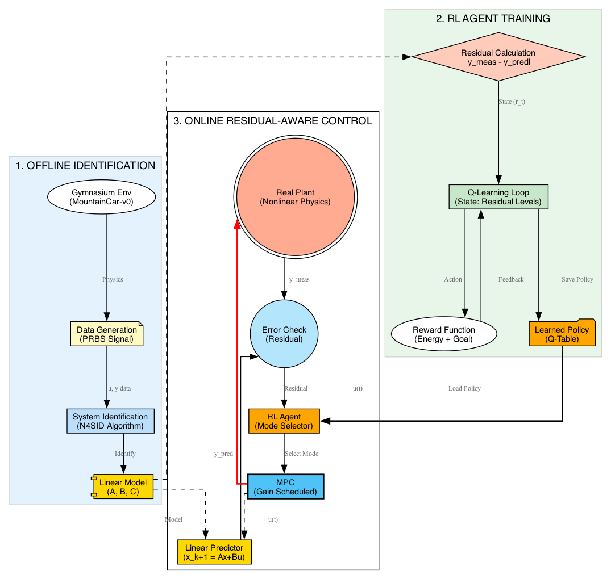
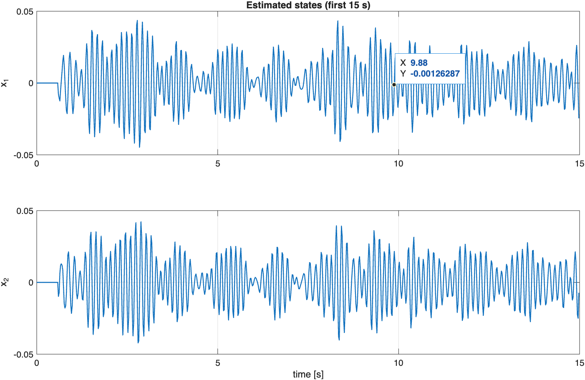
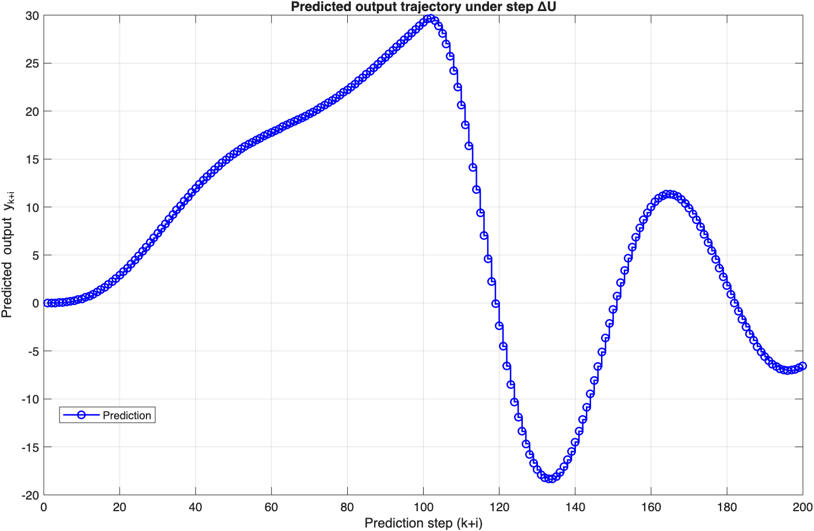
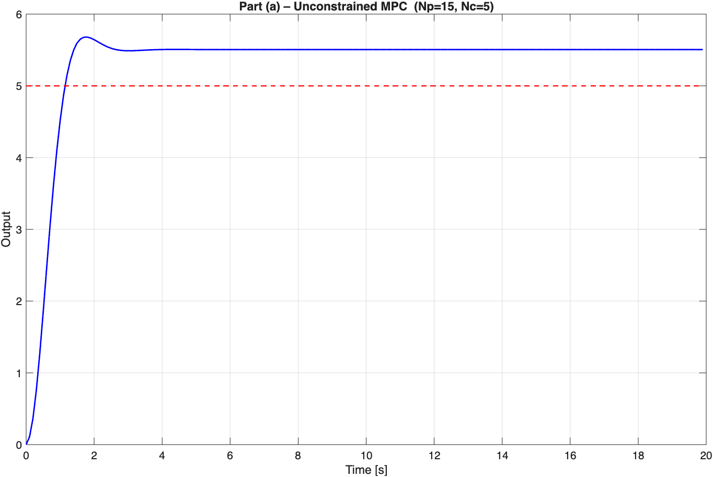
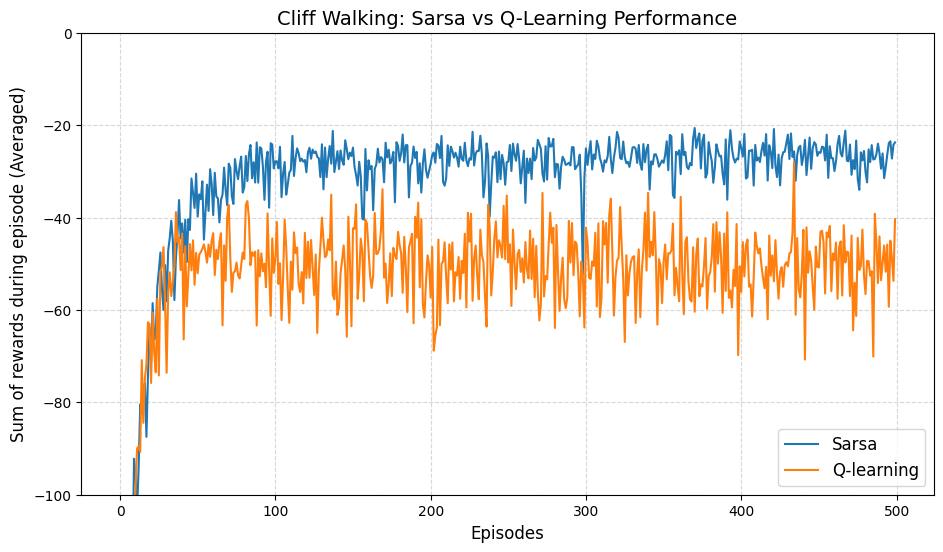

# ME 418/518 – Data-Based Control

This repository contains my coursework for **ME 418/518 – Data-Based Control**.  
It includes selected homework assignments, the midterm exam, and the course project, focusing on data-driven system identification, model predictive control (MPC), and learning-based control extensions.

---
## 🚀 Final Project: Residual-Aware RL–MPC

### Explicit Policy Conditioning on Model Reliability

This project introduces a **Self-Correcting Control Framework** that enables a standard Linear MPC to solve the highly nonlinear **MountainCar** problem. Instead of using complex Nonlinear MPC solvers, we employ a **Reinforcement Learning (RL) Supervisor** that monitors the "trustworthiness" of the linear model in real-time.

### 🎥 Demo: Solving the Mountain Car Problem
The Linear MPC (Baseline) gets stuck at the bottom. The **Residual-Aware RL-MPC** (Ours) detects the model failure, switches to a "Recovery Mode" to gain momentum, and successfully reaches the goal.

  https://github.com/user-attachments/assets/f0c4c6c0-cf55-4686-a772-4a5253d4f55b
  
<em>Figure 1: Successful swing-up maneuver achieved by the Residual-Aware Agent.</em>

---

### 💡 The Core Concept: "Residual as a State"

Most adaptive controllers look at the **Physical State** (Position, Velocity). We look at the **Model Reliability State** (Residual).

$$r_t = \|y_{measured} - y_{predicted}\|$$

* **Low Residual:** Trust the model $\to$ **Tracking Mode** (Aggressive).
* **High Residual:** Model is failing $\to$ **Recovery Mode** (Conservative/Swing-up).

### 🏗️ System Architecture
The framework consists of an offline identification phase (N4SID) and an online control loop where the RL agent acts as a gain scheduler based on the residual signal.

  
   
  <em>Figure 2: The closed-loop architecture integrating Linear Prediction and RL-based Decision Making.</em>

---

### 📊 Results & Strategy Analysis
The plot below visualizes the "Self-Correction" logic.
1.  **Red Line (Residual):** Spikes when the car hits the nonlinear gravity term on the hill.
2.  **Magenta Line (Mode):** The RL agent immediately switches from **Mode 2 (Tracking)** to **Mode 1 (Recovery)**.
3.  **Outcome:** The car reverses to gain potential energy (swing-up) instead of stalling.

  
   
  <em>Figure 3: Time-series analysis showing the correlation between Model Mismatch (Residual) and RL Action (Mode Switching).</em>

| Metric | Baseline MPC | Residual-Aware RL–MPC |
| :--- | :---: | :---: |
| **Success Rate** | 0% | **100%** |
| **Solver Type** | Convex QP | Convex QP + RL Lookup |
| **Strategy** | Static | **Adaptive** |

---

## Homework Assignments

### Homework 2 – Subspace Identification (N4SID)
This assignment focuses on manual implementation of the N4SID algorithm using synthetic input–output data.  
The system order is determined via singular value decomposition, and state trajectories are reconstructed using projected future outputs.

**Included figure:**  
- Estimated state trajectories obtained from the manual N4SID procedure.

  

---

### Homework 3 – MPC Prediction Formulation
This homework studies the prediction structure used in Model Predictive Control.  
The lifted prediction model is constructed using the derived \(F\), \(H\), \(S\), and \(\Phi\) matrices, and the effect of a step change in the control increments is analyzed.

**Included figure:**  
- Predicted output trajectory under a step \(\Delta U\).

  

---

### Homework 4 – Model Predictive Control Design
In this assignment, unconstrained and constrained MPC controllers are designed and evaluated.  
Different prediction and control horizon choices are compared to illustrate the trade-off between tracking performance and control effort.

**Included figure:**  
- Unconstrained MPC step reference tracking for a selected \((N_p, N_c)\) pair.

  

---

## Midterm Exam

The midterm exam covers data generation, signal cleaning, FIR and ARX model identification, and MPC design under constraints and measurement noise.  
All simulations were implemented in MATLAB, and the report includes detailed explanations and validation results.

**Included figure:**  
- MPC tracking performance under measurement noise for a step reference.

  

---

### Homework 5 – On-Policy vs Off-Policy Reinforcement Learning (Cliff Walking)

This assignment compares **Sarsa (on-policy)** and **Q-learning (off-policy)** algorithms using the classic Cliff Walking environment.  
Both methods were implemented from scratch and evaluated over multiple independent runs to obtain averaged learning curves.

The results highlight a key conceptual difference:  
Sarsa accounts for the risk introduced by exploration and therefore learns a safer path away from the cliff, while Q-learning converges to the optimal (shortest) path but suffers from poor online performance due to occasional exploratory actions that lead to catastrophic penalties.

**Included figure:**  
- Average episode return comparison of Sarsa and Q-learning over 500 episodes.

  

---

## Course Project

### Residual-Aware RL Tuning of MPC on Data-Driven Models

The course project proposes a **Residual-Aware Reinforcement Learning–MPC framework**, where an RL agent tunes MPC parameters based on real-time model residuals.  
Data-driven identification methods (ARX, FIR, N4SID) are used to construct predictive models, and the one-step prediction residual is treated as a measure of model reliability.

The main objective is to enable the controller to adapt its aggressiveness depending on how much it can trust its internal model, improving robustness under modeling errors and uncertainty.

Project materials in this repository include:
- Project proposal,
- Progress report,
- Supporting references and planned evaluation metrics.

---

## Notes

- All MATLAB code was written independently for this course.
- Large language models and code-generation tools were **not used** during exams or restricted assessments.
- Figures included here are representative summaries; full derivations and results are provided in the submitted reports.

---

**Author:** Erinç Ada Ceylan  
**Program:** Mechanical Engineering, Bilkent University  
**Course:** ME 418/518 – Data-Based Control
